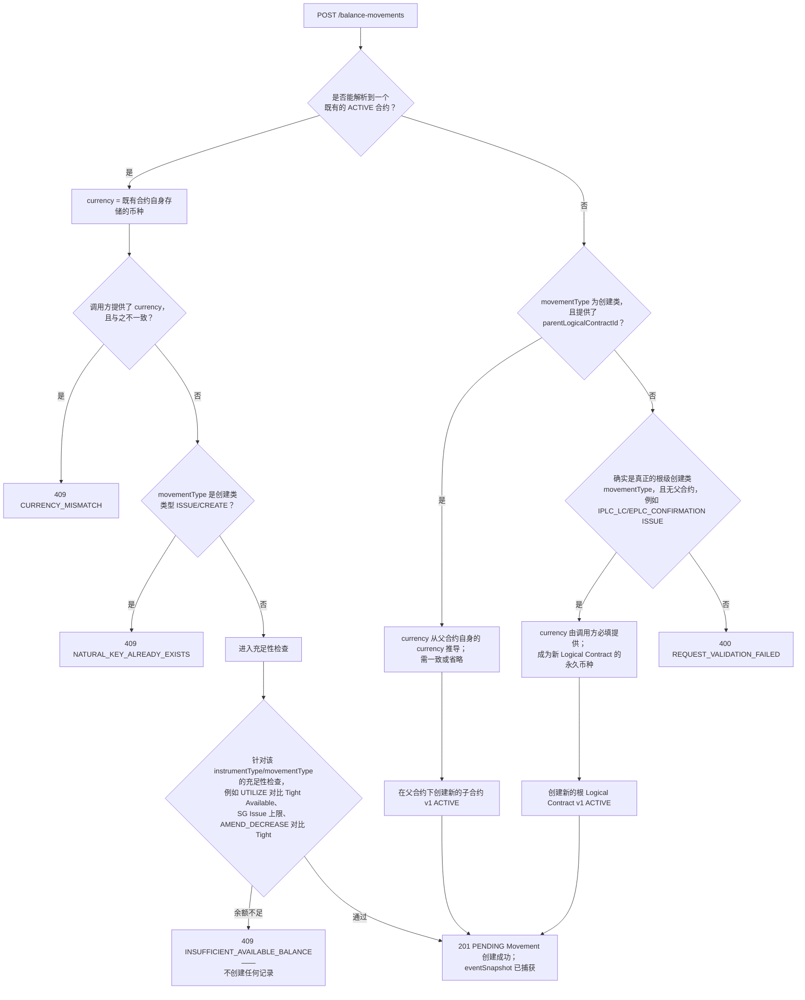

# POST /balance-movements——货币推导与充足性检查决策流程

展示微服务如何把一个新到的创建请求解析为「对应到既有合约」「由父合约派生的子合约」或「全新的根 Logical Contract」，以及每一个硬性拒绝（409/400）具体在哪一步触发。

## Source Evidence

- `balance-component-api.yaml lines 52-81, 730-839`

## Related Knowledge

- OpenAPI Specs — Microservice + Channel API
- [[Business-Rule-Index]]
