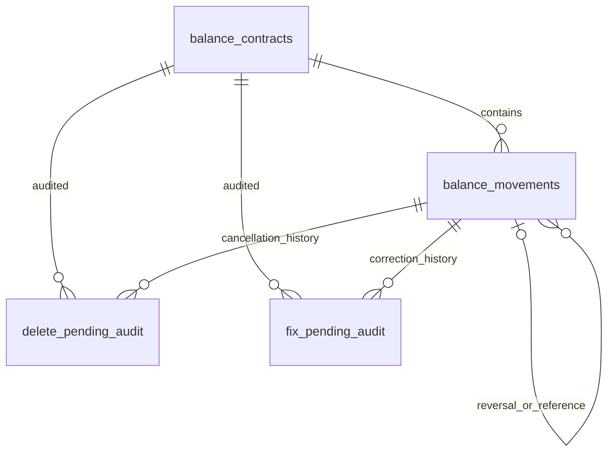

# Data Tables Layout

> [!important] Source of truth
> 本筆記由目前 repository 產生。若文件與程式不一致，以 Source Code、測試及 OAS 為準。

## Relationship layout

## Storage conventions

- Monetary values use SQLite `TEXT` decimal strings; JavaScript floating point is not the authority.
- Date／time values are persisted as ISO-compatible `TEXT`; optional business dates remain nullable.
- `account_entries`, warnings and snapshot columns contain serialized JSON.
- `balance_contracts` is versioned; `balance_movements` is the event ledger.
- Audit tables are append-only histories and do not replace the current movement row.
- Foreign keys connect movements／audits to their contract and movement identity.

## balance_contracts

保存 logical contract 的版本、natural keys、status、currency、tenor、tolerance 與 lifecycle dates。

| Column | SQLite type | Constraints／meaning from schema |
|---|---|---|
| `balance_contract_id` | `TEXT` | `PRIMARY KEY` |
| `logical_contract_id` | `TEXT` | `NOT NULL` |
| `contract_version` | `INTEGER` | `NOT NULL` |
| `instrument_type` | `TEXT` | `NOT NULL CHECK (instrument_type IN (${sqlInList(INSTRUMENT_TYPE_VALUES)}))` |
| `lc_number` | `TEXT` | `NOT NULL` |
| `ib_number` | `TEXT` | — |
| `sg_number` | `TEXT` | — |
| `leg_seq` | `TEXT` | — |
| `parent_logical_contract_id` | `TEXT` | — |
| `status` | `TEXT` | `NOT NULL CHECK (status IN (${sqlInList(CONTRACT_STATUS_VALUES)}))` |
| `currency` | `TEXT` | `NOT NULL` |
| `tolerance_pct` | `TEXT` | — |
| `tenor_type` | `TEXT` | `CHECK (tenor_type IS NULL OR tenor_type IN (${sqlInList(TENOR_TYPE_VALUES)}))` |
| `tenor_days` | `INTEGER` | — |
| `maturity_date` | `TEXT` | — |
| `expiry_date` | `TEXT` | — |
| `mail_float_grace_days` | `INTEGER` | — |
| `opening_balance` | `TEXT` | `NOT NULL` |
| `source_amendment_no` | `INTEGER` | — |
| `effective_from` | `TEXT` | `NOT NULL` |
| `effective_to` | `TEXT` | — |
| `created_by` | `TEXT` | `NOT NULL` |
| `created_at` | `TEXT` | `NOT NULL` |

## balance_movements

保存 append-oriented transaction movement、Maker／Checker actors、references、amounts、account entries 與 event snapshots。

| Column | SQLite type | Constraints／meaning from schema |
|---|---|---|
| `movement_id` | `TEXT` | `PRIMARY KEY` |
| `balance_contract_id` | `TEXT` | `NOT NULL REFERENCES balance_contracts(balance_contract_id)` |
| `event_seq` | `INTEGER` | `NOT NULL` |
| `business_event_id` | `TEXT` | — |
| `movement_type` | `TEXT` | `NOT NULL CHECK (movement_type IN (${sqlInList(MOVEMENT_TYPE_VALUES)}))` |
| `exposure_nature` | `TEXT` | `NOT NULL CHECK (exposure_nature IN (${sqlInList(EXPOSURE_NATURE_VALUES)}))` |
| `amount` | `TEXT` | `NOT NULL` |
| `ceiling_amount` | `TEXT` | `NOT NULL` |
| `tolerance_pct` | `TEXT` | — |
| `tolerance_change_pct` | `TEXT` | — |
| `tolerance_change_direction` | `TEXT` | `CHECK (tolerance_change_direction IS NULL OR tolerance_change_direction IN ('INCREASE','DECREASE'))` |
| `currency` | `TEXT` | `NOT NULL` |
| `leg_ref` | `TEXT` | — |
| `account_entries         TEXT, -- JSON` | `` | — |
| `contingent_account_entry` | `TEXT` | — |
| `lmts_reservation_id` | `TEXT` | — |
| `status` | `TEXT` | `NOT NULL CHECK (status IN (${sqlInList(MOVEMENT_STATUS_VALUES)}))` |
| `reversal_of_movement_id` | `TEXT` | `REFERENCES balance_movements(movement_id)` |
| `reason_code` | `TEXT` | — |
| `remarks` | `TEXT` | — |
| `new_expiry_date` | `TEXT` | — |
| `transaction_date` | `TEXT` | — |
| `business_date` | `TEXT` | — |
| `value_date` | `TEXT` | — |
| `source_module` | `TEXT` | — |
| `source_function` | `TEXT` | — |
| `source_transaction_ref` | `TEXT` | — |
| `referenced_transaction_id` | `TEXT` | — |
| `balance_before` | `TEXT` | — |
| `balance_after` | `TEXT` | — |
| `warnings                TEXT, -- JSON` | `` | — |
| `created_by` | `TEXT` | `NOT NULL` |
| `released_by` | `TEXT` | — |
| `created_at` | `TEXT` | `NOT NULL` |
| `released_at` | `TEXT` | — |
| `acknowledged_by` | `TEXT` | — |
| `acknowledged_at` | `TEXT` | — |
| `maker_submitted_by` | `TEXT` | — |
| `maker_submitted_at` | `TEXT` | — |
| `event_snapshot` | `TEXT` | — |
| `root_event_snapshot` | `TEXT` | — |
| `acceptance_event_snapshot` | `TEXT` | — |
| `sg_event_snapshot` | `TEXT` | — |
| `finalize_event_snapshot` | `TEXT` | — |
| `finalize_acceptance_event_snapshot` | `TEXT` | — |
| `finalize_sg_event_snapshot` | `TEXT` | — |
| `present_docs_consumed_at` | `TEXT` | — |
| `present_docs_consumed_by` | `TEXT` | — |
| `cancelled_by` | `TEXT` | — |
| `cancelled_at` | `TEXT` | — |
| `edited_by` | `TEXT` | — |
| `edited_at` | `TEXT` | — |
| `amendment_approved` | `INTEGER` | — |
| `amendment_effective` | `TEXT` | — |
| `consent_status` | `TEXT` | — |

## delete_pending_audit

每次 Delete Pending 的 append-only audit，保留取消前狀態及操作者。

| Column | SQLite type | Constraints／meaning from schema |
|---|---|---|
| `audit_id` | `TEXT` | `PRIMARY KEY` |
| `delete_seq` | `INTEGER` | `NOT NULL` |
| `movement_id` | `TEXT` | `NOT NULL REFERENCES balance_movements(movement_id)` |
| `balance_contract_id` | `TEXT` | `NOT NULL REFERENCES balance_contracts(balance_contract_id)` |
| `event_seq` | `INTEGER` | `NOT NULL` |
| `movement_type` | `TEXT` | `NOT NULL` |
| `source_transaction_ref` | `TEXT` | — |
| `status_before` | `TEXT` | `NOT NULL CHECK (status_before IN ('PENDING', 'REJECTED'))` |
| `cancelled_by` | `TEXT` | `NOT NULL` |
| `cancelled_at` | `TEXT` | `NOT NULL` |
| `reason_code` | `TEXT` | — |
| `remarks` | `TEXT` | — |

## fix_pending_audit

每次 Fix Pending 的 append-only before／after audit；原 movement 維持相同 identity。

| Column | SQLite type | Constraints／meaning from schema |
|---|---|---|
| `audit_id` | `TEXT` | `PRIMARY KEY` |
| `edit_seq` | `INTEGER` | `NOT NULL` |
| `movement_id` | `TEXT` | `NOT NULL REFERENCES balance_movements(movement_id)` |
| `balance_contract_id` | `TEXT` | `NOT NULL REFERENCES balance_contracts(balance_contract_id)` |
| `event_seq` | `INTEGER` | `NOT NULL` |
| `original_created_by` | `TEXT` | `NOT NULL` |
| `original_created_at` | `TEXT` | `NOT NULL` |
| `status_before` | `TEXT` | `NOT NULL CHECK (status_before IN ('PENDING', 'REJECTED'))` |
| `before_snapshot` | `TEXT` | `NOT NULL, -- JSON, full pre-edit movement content` |
| `after_snapshot` | `TEXT` | `NOT NULL, -- JSON, the corrected field values this edit applied` |
| `edited_by` | `TEXT` | `NOT NULL` |
| `edited_at` | `TEXT` | `NOT NULL` |

## balance_account_mappings

保存 product／risk-class 到兩組 account number／description 的 versioned runtime mapping。

| Column | SQLite type | Constraints／meaning from schema |
|---|---|---|
| `mapping_key` | `TEXT` | `PRIMARY KEY` |
| `instrument_type` | `TEXT` | `NOT NULL CHECK (instrument_type IN (${sqlInList(INSTRUMENT_TYPE_VALUES)}))` |
| `risk_class` | `TEXT` | `NOT NULL CHECK (risk_class IN ('SIGHT','BUYERS_USANCE','SELLERS_USANCE','USANCE'))` |
| `account_a_number` | `TEXT` | `NOT NULL` |
| `account_a_description` | `TEXT` | `NOT NULL` |
| `account_b_number` | `TEXT` | `NOT NULL` |
| `account_b_description` | `TEXT` | `NOT NULL` |
| `version` | `INTEGER` | `NOT NULL CHECK (version > 0)` |
| `updated_by` | `TEXT` | `NOT NULL` |
| `updated_at` | `TEXT` | `NOT NULL` |

## Index layout

| Index | Table | Kind | Columns | Predicate |
|---|---|---|---|---|
| `idx_contracts_logical_version` | `balance_contracts` | UNIQUE | `logical_contract_id, contract_version` | — |
| `idx_contracts_one_active` | `balance_contracts` | UNIQUE | `logical_contract_id` | `status = 'ACTIVE'` |
| `idx_contracts_naturalkey` | `balance_contracts` | INDEX | `instrument_type, lc_number, ib_number, sg_number, leg_seq` | — |
| `idx_contracts_catalog` | `balance_contracts` | INDEX | `instrument_type, status` | — |
| `idx_contracts_parent` | `balance_contracts` | INDEX | `parent_logical_contract_id, instrument_type` | — |
| `idx_movements_idempotency` | `balance_movements` | UNIQUE | `balance_contract_id, event_seq` | — |
| `idx_movements_contract_status` | `balance_movements` | INDEX | `balance_contract_id, status` | — |
| `idx_movements_business_event` | `balance_movements` | INDEX | `business_event_id` | — |
| `idx_delete_pending_audit_movement` | `delete_pending_audit` | INDEX | `movement_id` | — |
| `idx_delete_pending_audit_contract` | `delete_pending_audit` | INDEX | `balance_contract_id` | — |
| `idx_fix_pending_audit_movement` | `fix_pending_audit` | INDEX | `movement_id` | — |
| `idx_fix_pending_audit_contract` | `fix_pending_audit` | INDEX | `balance_contract_id` | — |

## Migration rule

`SCHEMA_SQL` defines a fresh database. Existing databases advance through the ordered migrations in `migrations.ts`; do not infer an upgrade path only from the final table definition.
