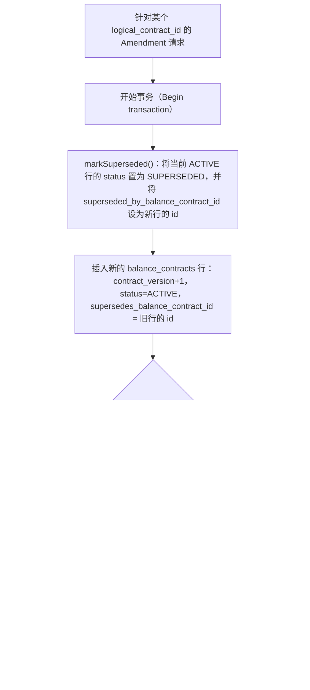

# 修改版本链（合约版本替代）

说明一次 Amendment 如何生成新的 ACTIVE 合约版本，同时将前一版本标记为 SUPERSEDED，并由部分唯一索引（partial unique index）提供保护。

## 来源证据

- `Balance-Component-DB-Design.txt §2.4 (lines 93-104), §4.1.1 (lines 211-213), §4.1.2 markSuperseded/listVersions rows (lines 232-246)`

## 相关知识

- DB Design + DB Optimization Analysis Docs
- [[Business-Rule-Index]]
