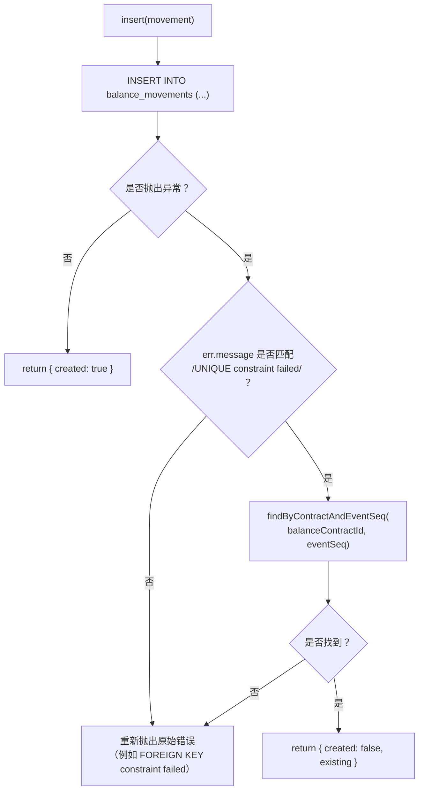

# BalanceMovementStore.insert() ——基于 (balanceContractId, eventSeq) 的幂等创建

说明同一笔流水创建请求的重复提交如何被检测出来，并转化为安全的空操作而非错误，而其他各类数据库失败则照常向上传播。

## 来源证据

- `microservices/balance-component/src/store/balanceMovementStore.ts:128-211`

## 相关知识

- Data Model — DB Schema, Migrations, Stores, Types/Money/Errors
- [[Business-Rule-Index]]
