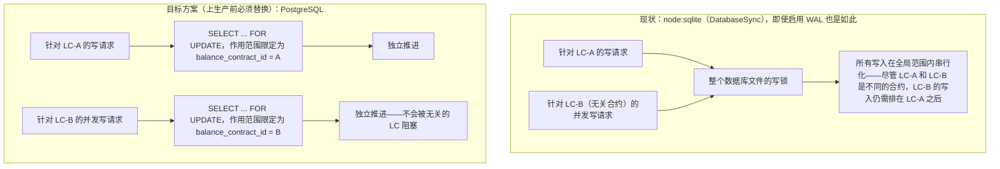

# 并发模型：现行 SQLite 整文件锁 与 未来必需的 PostgreSQL 行级锁

说明当前单进程原型所使用的 SQLite 引擎，为何无法满足“同一 LC 串行化、不同 LC 之间绝不互相阻塞”的业务需求，并展示改用 PostgreSQL 行级锁之后会是什么样子。

## 来源证据

- `Balance-Component-DB-Design.txt §1.1 (lines 47-58), §8.1 (lines 767-774)`
- `Balance-Component-DB-Optimization-Analysis.txt §3 (lines 198-207)`

## 相关知识

- DB Design + DB Optimization Analysis Docs
- [[Business-Rule-Index]]
