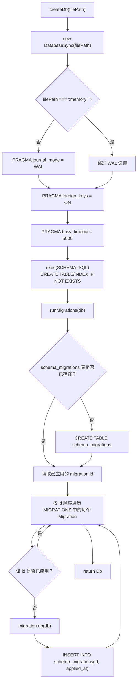

# createDb() 初始化流程

展示从打开 DatabaseSync 句柄到得到一个就绪、已完成迁移的 Db 对象的完整启动路径，说明文件模式与 :memory: 模式的分支、以及迁移执行器，相对于固定的 PRAGMA 执行顺序分别处于什么位置。

## 来源证据

- `microservices/balance-component/src/db/index.ts:28-44`
- `microservices/balance-component/src/db/migrations.ts:309-325`

## 相关知识

- Data Model — DB Schema, Migrations, Stores, Types/Money/Errors
- [[Business-Rule-Index]]
