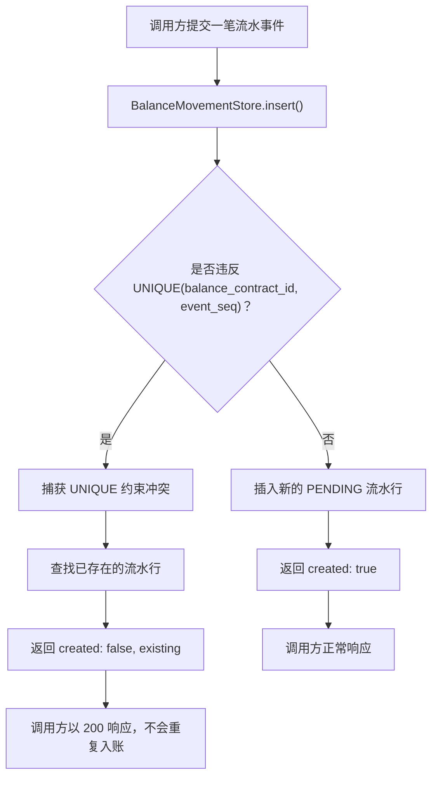

# 幂等的流水插入（UNIQUE 幂等键处理）

说明 BalanceMovementStore.insert() 如何处理重复的 (balance_contract_id, event_seq) 提交，以及如何处理真正全新的提交。

## 来源证据

- `Balance-Component-DB-Design.txt §2.3 (lines 83-91), §4.2.7 insert row (lines 430-432)`

## 相关知识

- DB Design + DB Optimization Analysis Docs
- [[Business-Rule-Index]]
