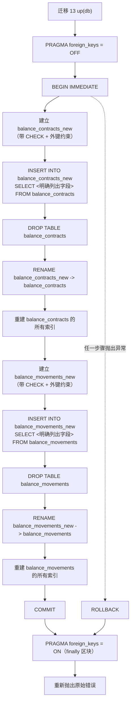

# 迁移 13——透过 SQLite 12 步表重建法补齐 CHECK/外键约束

说明一个已存在于磁盘上的数据库，如何被升级为带有 CHECK 约束与自引用外键——这两种约束是 SQLite 的 ALTER TABLE 无法追加到既有字段上的；同时说明重建过程中途失败时，如何保证绝不会留下一个迁移到一半的数据库。

## 来源证据

- `microservices/balance-component/src/db/migrations.ts:152-306`
- `microservices/balance-component/test/unit/db/migrations.test.ts:78-116`

## 相关知识

- Data Model — DB Schema, Migrations, Stores, Types/Money/Errors
- [[Business-Rule-Index]]
