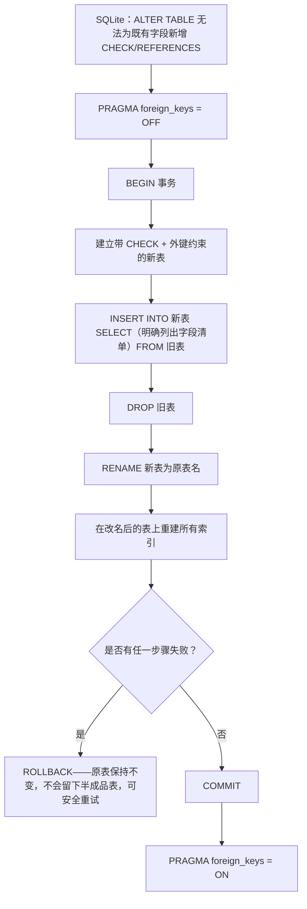

# 透过表重建来新增 CHECK/外键约束的迁移（迁移 13）

SQLite 无法用 ALTER TABLE 为既有字段新增 CHECK 或 REFERENCES 约束，因此迁移 13 在单一事务内使用官方的“重建表”做法。

## 来源证据

- `Balance-Component-DB-Optimization-Analysis.txt P2 CHECK-constraint row (lines 136-149)`

## 相关知识

- DB Design + DB Optimization Analysis Docs
- [[Business-Rule-Index]]
