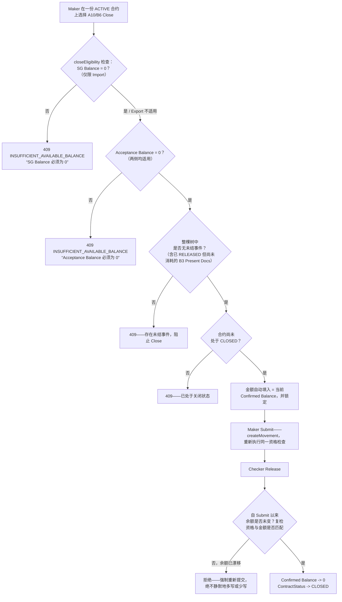

# A10/B6 Close——资格判定关卡与核销流程

两道防线（createMovement() 自身的充足性检查，以及 release() 自身的复检）都调用同一个共享的 evaluateContractCloseEligibility()，因此选择器的提示、Submit 时的检查与 Release 时的复检永远不会出现分歧。金额从不由人工输入——它在检查发生的当下自动从 Confirmed Balance 派生并锁定。

## 相关知识

- Quality/Remediation History Docs
- [[Business-Rule-Index]]
