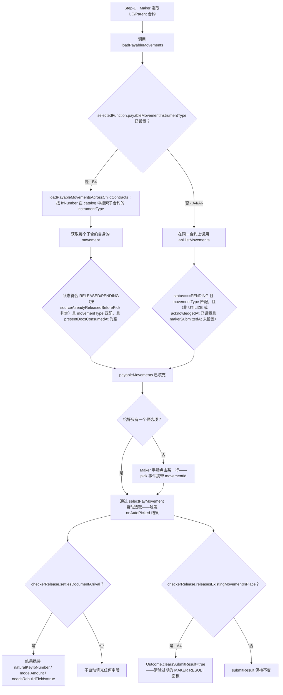

# A4/A6 应付款项异动选择与四眼原则资格管控

从 Step-1 的 LC 选择，到 Step-2 的应付款项异动自动选取/手动选取，再到最终把字段补丁应用到 Maker 表单上的完整过程。

```mermaid
flowchart TD
  A[Step-1：Maker 选取 LC/Parent 合约] --> B[调用 loadPayableMovements]
  B --> C{selectedFunction.payableMovementInstrumentType 已设置？}
  C -->|是 - B4| D[loadPayableMovementsAcrossChildContracts：按 lcNumber 在 catalog 中搜索子合约的 instrumentType]
  D --> E[获取每个子合约自身的 movement]
  E --> F{状态符合 RELEASED/PENDING（按 sourceAlreadyReleasedBeforePick 判定）且 movementType 匹配，且 presentDocsConsumedAt 为空}
  C -->|否 - A4/A6| G[在同一合约上调用 api.listMovements]
  G --> H{status===PENDING 且 movementType 匹配，且（非 UTILIZE 或 acknowledgedAt 已设置且 makerSubmittedAt 未设置）}
  F --> I[payableMovements 已填充]
  H --> I
  I --> J{恰好只有一个候选项？}
  J -->|是| K[通过 selectPayMovement 自动选取——触发 onAutoPicked 结果]
  J -->|否| L[Maker 手动点击某一行——pick 事件携带 movementId]
  L --> K
  K --> M{checkerRelease.settlesDocumentArrival？}
  M -->|是| N[结果携带 naturalKeyIbNumber / modelAmount / needsRebuildFields=true]
  M -->|否| O[不自动填充任何字段]
  K --> P{checkerRelease.releasesExistingMovementInPlace？}
  P -->|是 - A4| Q[Outcome.clearsSubmitResult=true——清除过期的 MAKER RESULT 面板]
  P -->|否| R[submitResult 保持不变]
```

## 相关知识

- Angular Pickers, Eligibility Hints, Orchestrating Shell
- [[Business-Rule-Index]]
