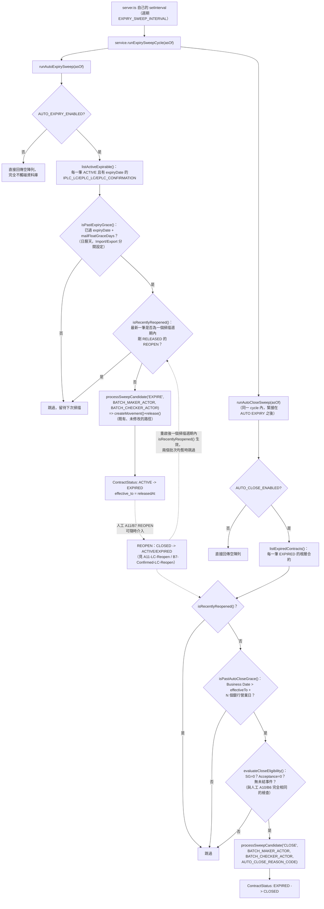

# AUTO EXPIRY / AUTO CLOSE 背景批次架構與 Grace Period

本筆記是 F1 功能史詩（external BA review，「UCP 600 第16(f)條自動釋放」提案 `analysis/Balance-Component-F1-Expire-Proposal-zh.md`）新增的兩個獨立背景批次——AUTO EXPIRY 與 AUTO CLOSE——的跨功能架構總覽。這兩個批次不屬於任何單一具名業務功能（A11/B7 是人工重啟入口，AUTO EXPIRY/AUTO CLOSE 是完全自動、日期觸發的批次），故獨立成一篇 09-Architecture 筆記，而非掛在某個 Function Analysis 筆記底下。

## 觸發機制：`server.ts` 自己的 `setInterval`，刻意不放進 `BalanceService` 建構子

背景排程只在 `microservices/balance-component/src/server.ts` 註冊一次 `setInterval(() => service.runExpirySweepCycle(), toIntervalMs(EXPIRY_SWEEP_INTERVAL))`，刻意**不**放進 `BalanceService` 的建構子——文件註解明確記載理由：這個測試套件裡絕大多數測試都是直接 `new BalanceService(db)`，若排程邏輯藏在建構子裡，每一個這樣的測試都會意外啟動一個真實的計時器。`EXPIRY_SWEEP_INTERVAL`（`config.ts`）demo/dev 預設為每 30 秒一次，文件註解記載正式環境只需把這一個值改成 `{ value: 1, unit: 'days' }`，程式碼本身不需要改動。`runExpirySweepCycle()` 是 `server.ts` 這個 `setInterval` 呼叫的唯一入口，內部固定順序執行：先 `runAutoExpirySweep(asOf)`，再**同一個 cycle 內**執行 `runAutoCloseSweep(asOf)`。

## 兩個獨立、各自可關閉的批次

`AUTO_EXPIRY_ENABLED`／`AUTO_CLOSE_ENABLED`（`config.ts`）是兩個獨立的功能旗標，理由是業務風險等級不同：AUTO EXPIRY 有真實的會計/曝險影響（沖銷合約自身的 Confirmed Balance），AUTO CLOSE 則只是對一筆已經沒有曝險影響的 EXPIRED 合約做狀態最終化——設計上讓 AUTO EXPIRY 先上線觀察，AUTO CLOSE 之後再開啟。任一旗標關閉時，對應的 `run*Sweep()` 直接回傳空陣列，完全不觸碰資料庫。

- **AUTO EXPIRY**（`runAutoExpirySweep()`）：掃描每一筆 `ACTIVE` 且已記錄 `expiryDate` 的根層合約（`listActiveExpirable()`），逐筆檢查是否已過 `expiryDate + mailFloatGraceDays`（[[STATUS-RULE-031]]），通過者建立並釋放一筆 `EXPIRE` movement——資格判定刻意**不**比照 CLOSE 的 SG/Acceptance 餘額歸零條件（[[MOVEMENT-RULE-063]]）。
- **AUTO CLOSE**（`runAutoCloseSweep()`）：掃描每一筆 `EXPIRED` 的根層合約（`listExpiredContracts()`），套用與人工 A10/B6 完全相同的 `evaluateCloseEligibility()`（SG/Acceptance 歸零、無未結事件），再疊加 Auto Close Grace Period（[[STATUS-RULE-033]]），通過者建立並釋放一筆 `CLOSE` movement，`reasonCode` 固定為 `AUTO_CLOSE_REASON_CODE`（[[MAKER-CHECKER-RULE-059]]）。

兩個批次都透過 `processSweepCandidate()` 呼叫**既有、完全未修改的** `createMovement()`/`release()` 路徑——不是另開一條「系統批次專用」的寫入邏輯，而是與人工 A10/A11/B6/B7 共用同一段程式碼，僅呼叫端提供的 `createdBy`/`releasedBy` 是兩個固定的系統身份字串 `BATCH_MAKER_ACTOR`/`BATCH_CHECKER_ACTOR`（[[MAKER-CHECKER-RULE-058]]）——藉此讓既有、完全未修改的 `assertMakerCheckerSeparation()` 四眼原則檢查自然通過，不需要任何「系統繞過」特例。`processSweepCandidate()` 對單一候選的失敗（例如在列出候選之後、實際處理之前，該合約已被其他並發請求改變而不再合格）採「回報而非拋出」的姿態——回傳 `{ balanceContractId, ok: false, error }`，不中斷整批掃描的其餘候選，與後端中台自己的 Business Case 回放 `runCase()` 直譯器「單一案例失敗不拖垮整批」的姿態一致。

## 兩層獨立的日期閘門，刻意不可混淆

F1 架構的一個核心設計原則（`config.ts` 頂部文件註解明確記載）：兩個批次各自的日期閘門完全獨立、錨點不同、天數單位不同，絕不可混為一談：

| 閘門 | 對象 | 錨點欄位 | 天數單位 | 常數 |
|---|---|---|---|---|
| `isPastExpiryGrace()` | AUTO EXPIRY（ACTIVE→EXPIRED） | `expiryDate`（合約自己聲明的到期日） | 日曆天 | `MAIL_FLOAT_GRACE_DAYS.IMPORT`/`EXPORT`（各 5 天，於 ISSUE 時鎖進合約欄位） |
| `isPastAutoCloseGrace()` | AUTO CLOSE（EXPIRED→CLOSED） | `effectiveTo`（合約變成 EXPIRED 的那一刻） | 銀行營業日 | `AUTO_CLOSE_GRACE_PERIOD_BUSINESS_DAYS = 2` |

`addBusinessDays()`（`domain/autoCloseGracePeriod.ts`）是刻意的 Phase 1 替代品，僅跳過週六/週日、無銀行假日曆——文件註解記載這是等待一個尚未建置的獨立「Standing」微服務（Phase 2）到位前的暫時實作。

## 「最近被重啟」的時效性豁免（`isRecentlyReopened()`）——與 Grace Period 並行的第二道防線

v1.21.0（2026-08-25，同日現場 UAT）新增 `isRecentlyReopened()`：若一筆合約自己最新一筆移動是狀態 `RELEASED` 的 `REOPEN`，且距其 `releasedAt` 不到一個完整掃描週期，兩個批次都會跳過它（[[STATUS-RULE-034]]）——這是為了防止「人工 A11/B7 才剛把一筆合約 Reopen，下一次掃描（甚至同一秒內下一輪 `setInterval`）就被 AUTO CLOSE 或 AUTO EXPIRY 立刻重新處理掉」。v1.24.0 新增的 Auto Close Grace Period 上線後，`isRecentlyReopened()` 並未被移除——F1 proposal §13.8 的協調說明記載兩者並行運作：Grace Period 解決的是「一筆從未動用過的合約在同一個掃描週期內被 EXPIRE 又立刻被 CLOSE」的一般性缺口，`isRecentlyReopened()` 解決的則是「人工才剛 Reopen，批次立刻又把它撿走」這個更窄、時間尺度以「一個掃描週期」而非「N 個營業日」計算的特定情境——兩者不是互相取代的關係。

## Submit-to-Release 視窗的一致防護姿態

`EXPIRE`／`CLOSE`／`REOPEN` 三者在 Checker Release 時都重新執行一次與 Submit 時完全相同的資格判定與金額比對（`evaluateContractExpiryEligibility()`／`evaluateContractCloseEligibility()`／`computeReopenRestoreAmount()`，各自排除自身這筆 PENDING 記錄），若 Submit 與 Release 之間狀態發生任何漂移，Release 一律拒絕並要求重新提交，絕不靜默覆寫——這是整個 Balance Component 既有、貫穿 A10/B6 的一致設計姿態，F1 三個新 movementType 沿用而非另創新規則。

## 流程圖

## 相關知識

- [[STATUS-RULE-031]] — AUTO EXPIRY 是唯一能把合約狀態從 ACTIVE 轉為 EXPIRED 的路徑
- [[STATUS-RULE-032]] — REOPEN 對合約狀態的重啟規則
- [[STATUS-RULE-033]] — Auto Close Grace Period
- [[STATUS-RULE-034]] — `isRecentlyReopened()` 時效性豁免
- [[STATUS-RULE-035]] — 專屬非 ACTIVE 合約 natural-key 解析後備路徑
- [[STATUS-RULE-036]] — EXPIRED 狀態徽標色彩與 Checker Queue includeAnyStatus
- [[MOVEMENT-RULE-063]] — EXPIRE 資格判定不比照 CLOSE 的餘額歸零條件
- [[MOVEMENT-RULE-064]] — REOPEN 復原金額計算
- [[MAKER-CHECKER-RULE-058]] — BATCH_MAKER_ACTOR/BATCH_CHECKER_ACTOR 保留真實四眼原則
- [[MAKER-CHECKER-RULE-059]] — CLOSE/REOPEN 強制 reasonCode，AUTO CLOSE 固定內部值
- [[A11-LC-Reopen]]
- [[B7-Confirmed-LC-Reopen]]
- [[a10-b6-close-eligibility-gate-and-write-off-flow]]
- [[Balance Architecture]]
- [[Business-Rule-Index]]
