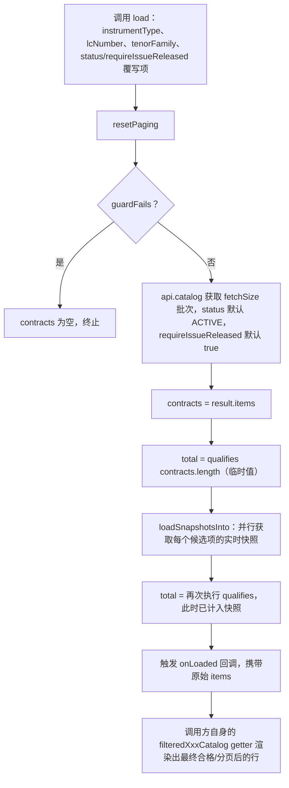

# CatalogPickerService 的 fetch/分页/合格判定 时序

一个分页型 Maker-ACTION 选择器，如何在依赖异步快照的过滤条件下，计算出真正合格的总数。

```mermaid
flowchart TD
  A[调用 load：instrumentType、lcNumber、tenorFamily、status/requireIssueReleased 覆写项] --> B[resetPaging]
  B --> C{guardFails？}
  C -->|是| D[contracts 为空，终止]
  C -->|否| E[api.catalog 获取 fetchSize 批次，status 默认 ACTIVE，requireIssueReleased 默认 true]
  E --> F[contracts = result.items]
  F --> G[total = qualifies contracts.length（临时值）]
  G --> H[loadSnapshotsInto：并行获取每个候选项的实时快照]
  H --> I[total = 再次执行 qualifies，此时已计入快照]
  I --> J[触发 onLoaded 回调，携带原始 items]
  J --> K[调用方自身的 filteredXxxCatalog getter 渲染出最终合格/分页后的行]
```

## 相关知识

- Angular Pickers, Eligibility Hints, Orchestrating Shell
- [[Business-Rule-Index]]
