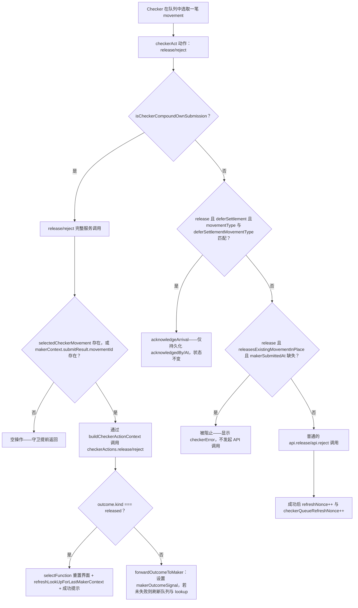

# Checker 动作派发与复合放行路由

Checker 面板上一次简单的 Release/Reject 点击，如何被解析为四种不同行为之一，其中包括那个让真正独立的 Checker 会话也能放行一笔它自己从未 Submit 过的复合（多腿）提交的修复。

## 相关知识

- Angular Pickers, Eligibility Hints, Orchestrating Shell
- [[Business-Rule-Index]]
