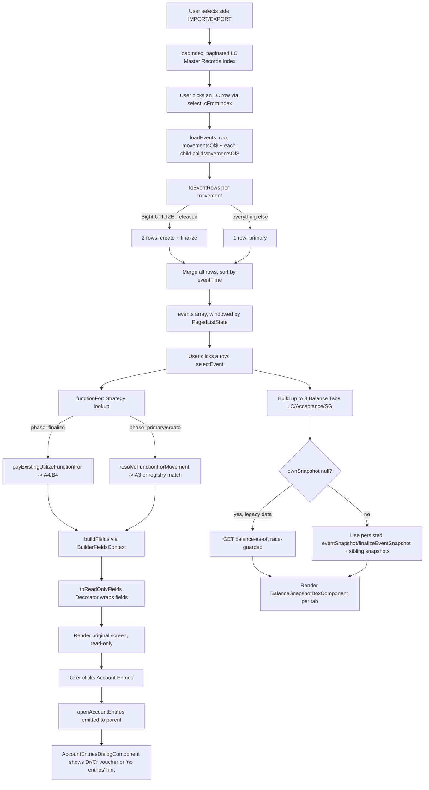

# Inquire Events——从选取 LC 到逐一钻取 Event（Facade/Strategy/Decorator/Adapter 流程）

从选取一个 side/LC，一路到查看某一历史 Event 的原始画面与 Balance Tabs，展示拆行规则与策略查找规则各自在哪个环节生效。

## Source Evidence

- `inquire-events.service.ts`
- `inquire-events.component.ts`
- `account-entries-dialog.component.ts`

## Related Knowledge

- Inquire Events + Look Up Current Balance (read-model)
- [[Business-Rule-Index]]
