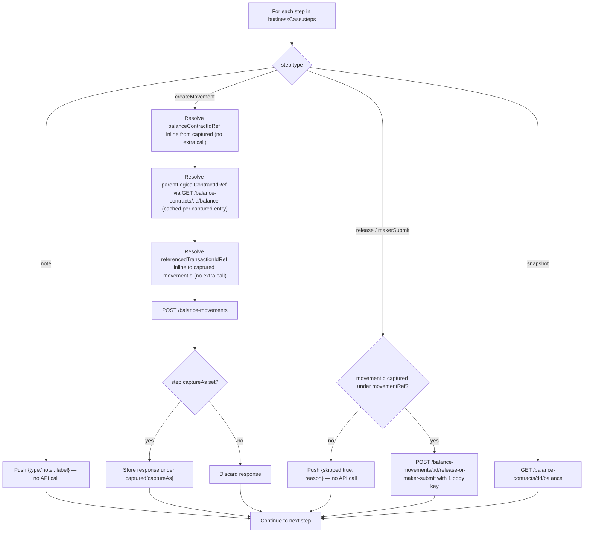

# runCase() 通用步骤执行器分派

编排器的单一通用执行器如何针对微服务解释 5 种步骤类型中的每一种，包括引用解析与被跳过步骤的兜底处理。

## Source Evidence

- `backend/server.js:64-137`

## Related Knowledge

- Business Case Registry (backend orchestrator) + Business Case Runner UI
- [[Business-Rule-Index]]

## 2026-08-26 更新——被引用步骤失败时的判空guard（"Run All Cases" 500 修复的一部分）

上面流程图中"Resolve ... Ref inline from captured"这几步，此前会直接解引用 `captured[ref].response.balanceContractId`/`.movementId`，未检查被引用的 `createMovement` 步骤是否真的成功。若该步骤因微服务限流（见 [[rate-limiter-false-positive-artifact-when-business-cases-are-run-back-]]，已修复）或业务规则拒绝而失败，这里会抛出一个裸 TypeError，最终在 API 层表现为一个无法诊断的通用 500。

2026-08-26 修复：`resolveLogicalContractId()`（`server.js:36-51`）与 createMovement 步骤自身的 `balanceContractIdRef`/`referencedTransactionIdRef` 解析（`server.js:85-113`）都加上了 `!referenced?.response?.balanceContractId` / `!entry.response?.movementId` 的显式判空，改为抛出说明性错误（指出具体是哪个 captureAs step 未产出预期字段），而不是任由裸解引用自然抛出 TypeError。`backend/test/runCase.test.js` 新增了对应回归测试。

### 证据来源（本次更新）
- `backend/server.js:36-51`
- `backend/server.js:85-113`
