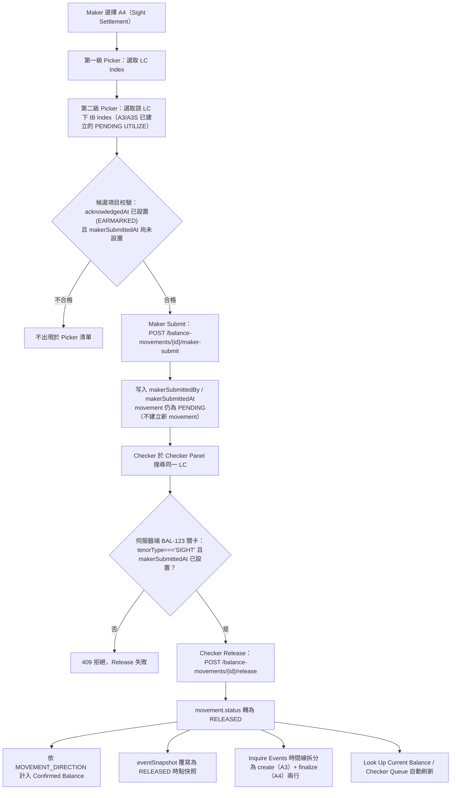

# A4 —— 即期結匯（Sight Settlement）功能分析

## 功能摘要

- **功能代碼**：A4
- **功能說明**：即期結匯（Sight Settlement）
- **instrumentType**：`IPLC_LC`
- **movementType**：`UTILIZE`（`catalogTenorFilter: 'SIGHT'` —— 僅限母 LC `tenorType === 'SIGHT'` 的個案）
- **所屬方向**：進口 Import
- **所屬母層功能**：A1（LC Issue，建立根合約，且根合約自身的 ISSUE 必須已 RELEASED 才能執行任何後續動作）／A3（或 A3S，Document Arrival —— 建立本功能所要終結的 PENDING `IPLC_LC`/`UTILIZE` earmark 記錄）
- **API 端點**（CONFIRMED，逐一核實自 `balance-component-api.yaml`／`balance-component-channel-api.yaml`）：
  - `POST /balance-movements/{movementId}/maker-submit` —— A4 專屬的真實 Maker 動作。A4 本身**不建立新 movement**（沒有 `createMovement()` 呼叫），而是對 A3/A3S 已建立的既有 PENDING `IPLC_LC`/`UTILIZE` 記錄寫入 `makerSubmittedBy`/`makerSubmittedAt`；本呼叫本身**不轉換狀態**，movement 全程仍為 `PENDING`（`balance-component-api.yaml` v1.4.0 changelog 及該端點自身 summary/description，行 999-1054）。
  - `POST /balance-movements/{movementId}/release` —— 通用 Checker Release 端點，由多個功能共用，行為依 request 對應的既有 movement 而定；A4 是其中**唯一真正令此筆 `IPLC_LC`/`UTILIZE` 完成落地**（PENDING → RELEASED）的路徑。針對 `tenorType === 'SIGHT'` 的 `IPLC_LC`/`UTILIZE`，伺服器端（BAL-123，v1.5.0）強制要求 `makerSubmittedAt` 已設置，否則回傳 409（`balance-component-api.yaml` 行 900-994，尤其 921-938、988-991）。
  - `GET /balance-contracts/catalog` —— 通用目錄查詢端點，供 A4 的 LC Index／IB Index 兩級 picker 使用（由 request 的 instrumentType/其他篩選條件決定候選集合），非 A4 專屬。
  - Channel API 對應（`balance-component-channel-api.yaml`）：`POST /channel/transactions/{transactionId}/release`。該規範明示 A4 的 `submitsTransaction: false`（行 638-640）——「A4 has no Maker submission step; it resolves directly to an existing PENDING UTILIZE transaction (created by A3/A3S) and the Checker acts on it via POST /channel/transactions/{id}/release directly」。**CONFLICT/UNCLEAR**：此描述與微服務 API 自身在 `/release` 端點強制執行的 BAL-123 伺服器端關卡（要求 `makerSubmittedAt` 已存在，見上）字面上不一致；兩份規範文件均未說明 Channel API 的實作內部是否會代為呼叫 `/maker-submit`，故此處僅如實記錄兩份規範各自的文字，不臆測其間的實作關係。

## Trigger → Output 全流程

1. **Trigger（觸發點）** —— CONFIRMED（`balance-component.model.ts` code `'A4'` 定義；`a4-sight-only-maker-submit-gate.md`）
   Maker 在 Transaction Builder 選擇 A4（Sight Settlement）功能。此功能只對母 LC `tenorType === 'SIGHT'` 的個案出現（`catalogTenorFilter: 'SIGHT'`）；Usance（`BUYERS_USANCE`/`SELLERS_USANCE`）個案改由 A6 處理。

2. **Input（輸入）** —— CONFIRMED（model.ts 對 A4 的 `help` 文字）
   - 第一級：LC Index picker，選取目標 `IPLC_LC` 合約。
   - 第二級：該 LC 項下仍為 PENDING 的 IB Index picker，即 A3（或 A3S）記錄的到單記錄。Amount 欄位**唯讀顯示**，直接沿用 A3 當初記錄的金額，本步驟不可重新輸入（「Amount is NOT re-typed here — it was already fixed when A3 recorded the presentation」）。

3. **Validation（校驗）** —— CONFIRMED
   - 候選項目必須已達成真正的四眼分離：`acknowledgedAt` 已設置（即 A3/A3S 自身的 Checker 已 acknowledge，顯示狀態為 EARMARKED 而非僅 EARMARKING），僅 Maker 自行 Submit（`makerSubmittedAt` 尚為 null）而未經 Checker acknowledge 的記錄不得出現在 A4 picker 中（[[MAKER-CHECKER-RULE-052]]／[[MAKER-CHECKER-RULE-041]]／[[MAKER-CHECKER-RULE-028]]）。
   - A4 自身已 Maker Submit 過的記錄（`makerSubmittedAt` 已設置）不得在 picker 中重複出現（[[MAKER-CHECKER-RULE-041]]）。
   - 根合約自身的 ISSUE 必須已 RELEASED（`assertRootIssueReleased`），否則任何非 ISSUE 動作皆會被拒（[[STATUS-RULE-008]]）。

4. **Classification（分類）** —— CONFIRMED
   `instrumentType = IPLC_LC`、`movementType = UTILIZE`、`catalogTenorFilter = SIGHT`。與 A6（`instrumentType = IPLC_ACCEPTANCE`，Usance 專用）互斥：母 LC 的 `tenorType` 決定進入 A4 或 A6 分支，Sight tenor 的母 LC 會直接阻斷任何子級 Acceptance 的 CREATE（[[MOVEMENT-RULE-002]]）。

5. **Business Decision（業務決策）** —— CONFIRMED
   - **Maker Submit**：呼叫 `POST /balance-movements/{movementId}/maker-submit`，對既有 PENDING `UTILIZE` 記錄寫入 `makerSubmittedBy`/`makerSubmittedAt`；不建立新 movement、不轉換狀態（`balance-component-api.yaml` v1.4.0）。
   - **Checker Release**：呼叫通用 `POST /balance-movements/{movementId}/release`。伺服器端（BAL-123）對 `tenorType === 'SIGHT'` 的 `IPLC_LC`/`UTILIZE` 強制要求 `makerSubmittedAt` 已存在，否則 409（[[MAKER-CHECKER-RULE-010]]／[[MAKER-CHECKER-RULE-057]]／[[MAKER-CHECKER-RULE-048]]）；此關卡按母合約 `tenorType` 範圍限定，不影響 Usance LC 自身經由 A6 複合式 release 落地的 `UTILIZE`（該路徑從不呼叫 `/maker-submit`）。用戶端 Transaction Builder 另有相同邏輯的前端防線（深度防禦，先於伺服器端關卡）：A4 自身的 Checker Release 按鈕，在其自身 Maker Submit 尚未存在之前會被前端阻擋（[[MAKER-CHECKER-RULE-011]]）。Checker 放行路由本身依功能形態而異，A4 屬於「原地終結（in-place finalize）」一類，區別於 A6/B4 的複合式來源結算與 A3/A3S 的延後處理（[[MAKER-CHECKER-RULE-015]]）。

6. **Balance/Exposure Decision（表內 vs 表外）** —— INFERRED（未在已核實的規則筆記中找到針對 A4 本身的直接陳述，依 `balance-component.model.ts` 的 A4 help 文字「`submitA4()` calls a dedicated maker-submit backend action on A3's own earmarked UTILIZE, not `createMovement()`」及 CLAUDE.md「Balance derivation」段推論）
   `IPLC_LC`/`UTILIZE` 屬於表內（on-balance-sheet）Contingent 曝險，非 SHGT 類的表外（off-balance-sheet）曝險。A4 本身不呼叫 `createMovement()`，因此不會重新觸發任何表外曝險相關的 sufficiency 檢查（如 `checkShgtIssueSufficiency`）——該類檢查僅發生在 A3/A3S 建立 movement 的當下。一旦 Checker Release 完成，該 `UTILIZE` 記錄狀態轉為 `RELEASED`，其 `ceilingAmount × MOVEMENT_DIRECTION` 即依公式計入 Confirmed Balance（[[BALANCE-RULE-001]]），而 `MOVEMENT_DIRECTION` 的正負號本身是按 instrument/movementType 組合固定不變的（[[MOVEMENT-RULE-001]]）；本筆記未逐一核實 `IPLC_LC`/`UTILIZE` 對應的正負號具體數值，標記為 **UNCLEAR**，留待對照 `domain/balanceDerivation.ts` 原始表格核實。

7. **Tolerance 決策**（若適用） —— CONFIRMED：不適用
   Tolerance/`ceilingAmount` 換算（`ceilingAmount = amount × (1 + tolerancePct/100)`）僅適用於 `IPLC_LC`/`EPLC_LC`（及 `EPLC_CONFIRMATION`）的 `ISSUE`/`AMEND*` 動作，`UTILIZE` 不在此門控範圍內（[[TOLERANCE-RULE-002]]／[[TOLERANCE-RULE-003]]／[[TOLERANCE-RULE-004]]）。A4 本身也不建立新 movement，故不涉及任何新的 `ceilingAmount` 轉換。

8. **Movement Posting Generation（過帳分錄）** —— CONFIRMED
   A4 不生成新的 movement 記錄，也不產生新的 Dr/Cr 記帳分錄（`contingentAccountEntry`）。該筆 `UTILIZE` 的 Dr/Cr 分錄已在 A3/A3S 建立當下一次性生成並持久化存放，且**永不重新計算**（CLAUDE.md「Contingent Liability Ledger + live account-entry generation」段）。A4 的 Maker Submit 與 Checker Release 只是將既有 PENDING 記錄最終轉為 RELEASED，不重新產生分錄。

9. **Output（輸出）** —— CONFIRMED
   - Maker Submit 成功：`makerSubmittedBy`/`makerSubmittedAt` 被寫入，movement 狀態仍為 `PENDING`。
   - Checker Release 成功：`movement.status` 轉為 `RELEASED`；`eventSnapshot` 於此時被覆寫為 RELEASED 時點的快照（`balance-component-api.yaml` v1.6.0）；成功後 Look Up Current Balance／Checker Queue 自動刷新（CLAUDE.md「Common Requirement」段）。
   - 在 Inquire Events 合併時間線上，這筆已終結的 Sight Document Arrival 拆分為一條「create」（A3 產生）與一條「finalize」（A4 完成）行，兩行的 Status/Balance-Impact 皆須讀取 movement 的即時真實狀態，不可凍結（[[MOVEMENT-RULE-030]]／[[MOVEMENT-RULE-032]]）；「finalize」階段的記錄行永遠不會被視為預留（earmark），即使 instrumentType/movementType 組合與 A3 完全相同（[[STATUS-RULE-020]]）；`payExistingUtilizeFunctionFor` 會將此較晚發生的 Release 時點事件解析為 A4，區別於 A3 自身的 Create 事件（[[MAKER-CHECKER-RULE-018]]）。

10. **Error/Exception（錯誤/例外）** —— CONFIRMED
    - `409`：Checker Release 對 `tenorType === 'SIGHT'` 的 `IPLC_LC`/`UTILIZE`，若 `makerSubmittedAt` 尚未設置，伺服器端強制回傳（BAL-123；`balance-component-api.yaml` 行 988-991；[[MAKER-CHECKER-RULE-010]]／[[MAKER-CHECKER-RULE-057]]）。
    - `400`：`/maker-submit` 端點對 instrumentType 非 `IPLC_LC` 或 movementType 非 `UTILIZE` 的 movement 回傳 400（`balance-component-api.yaml` 行 1013-1015 一帶）。
    - `409`：movement 非 `PENDING` 狀態時再次呼叫 `/maker-submit` 或 `/release` 亦回傳 409（一般 movement 狀態機規則）。
    - 用戶端防線：A4 自身的 Checker Release 在其自身 Maker Submit 尚未存在之前，會被前端提前阻擋，屬於伺服器端 BAL-123 關卡之外的深度防禦（[[MAKER-CHECKER-RULE-011]]）。
    - **BAL-122**（歷史缺陷，已修復，非目前行為，僅供稽核脈絡參考）：A4 畫面通用的「Delete Pending」按鈕曾經會誤刪其上游 A3/A3S 記錄（因 A4 本身無自己的 movement 可刪）——已透過 `*ngIf` 隱藏該按鈕解決（CLAUDE.md「BAL-122/BAL-123」段）。

## 流程圖

## 交叉引用（Related Knowledge）

**Maker/Checker 相關規則**
- [[MAKER-CHECKER-RULE-010]] —— 即期 IPLC_LC/UTILIZE（A4）在 Checker 放行前必須先有真實 Maker Submit（BAL-123，伺服器端強制）
- [[MAKER-CHECKER-RULE-011]] —— A4 自身 Checker Release 在其自身 Maker Submit 存在之前，會被用戶端阻擋（深度防禦）
- [[MAKER-CHECKER-RULE-057]] —— A4 四眼關卡在伺服器端強制執行，按母合約 tenorType==='SIGHT' 限定範圍
- [[MAKER-CHECKER-RULE-046]] —— A4 Maker Submit 關卡體現在 Business Case Registry 自身的 step 形態中
- [[MAKER-CHECKER-RULE-052]] —— A4/A6 picker 要求真正的 EARMARKED 狀態，而非僅 EARMARKING
- [[MAKER-CHECKER-RULE-041]] —— A4/A6 可用候選項需真正四眼原則，並排除 A4 自身已提交過的記錄
- [[MAKER-CHECKER-RULE-028]] —— 複核隊列 EARMARKING/EARMARKED 拆分：A4 要求候選項同時已確認並經 Maker 提交
- [[MAKER-CHECKER-RULE-015]] —— Checker 放行路由依功能形態而異：A4 屬原地終結，區別於 A6/B4 複合式與 A3/A3S 延後處理
- [[MAKER-CHECKER-RULE-018]] —— payExistingUtilizeFunctionFor 將較晚發生的 Release 事件解析為 A4，區別於 A3 的 Create 事件
- [[MAKER-CHECKER-RULE-048]] —— 伺服器端冪等性、re-ISSUE 防護與 BAL-123 Sight-UTILIZE Maker-Submit 關卡均記錄於 OAS
- [[MAKER-CHECKER-RULE-006]] —— requireIssueReleased 目錄過濾，適用於 Maker 操作類選取器（含 A4 的 LC Index picker）

**狀態／曝險／過帳相關規則**
- [[STATUS-RULE-008]] —— 根合約自身的 ISSUE 必須先被 RELEASED，才能進行其他任何動作
- [[STATUS-RULE-020]] —— finalize 階段的記錄行永遠不會被視為預留，即使 instrumentType/movementType 組合相同
- [[EXPOSURE-RULE-029]] —— 事件快照於寫入時一次性計算，唯一例外是 A4 終結 A3 的情形，寫入獨立的 finalize_* 欄位
- [[MOVEMENT-RULE-062]] —— 即期兌付被建模為單一的「先占用後釋放」複合步驟（A3/A3S 建立 PENDING，A4 完成收尾）
- [[MOVEMENT-RULE-032]] —— 處於 finalize 階段的事件解析到其終結函數（A4/B4），而非通用的 A3
- [[MOVEMENT-RULE-052]] —— 單據到單的 Pending→Approved 遷移，僅在真正發生 A4/A6 Release 時觸發
- [[MOVEMENT-RULE-030]] —— 已終結的 Sight 單據到達，在 Inquire Events 時間線上拆分為 create 與 finalize 兩行
- [[MOVEMENT-RULE-002]] —— Sight tenor 母 LC 直接阻斷任何子級 Acceptance 的 CREATE
- [[MOVEMENT-RULE-001]] —— MOVEMENT_DIRECTION 的正負號按 instrument/movementType 組合固定不變
- [[BALANCE-RULE-001]] —— Confirmed Balance = 所有 RELEASED 變動記錄的 ceilingAmount × MOVEMENT_DIRECTION 之和

**Tolerance 相關規則**
- [[TOLERANCE-RULE-002]] —— Tolerance 換算的 instrumentType 適用性門控
- [[TOLERANCE-RULE-003]] —— Tolerance 換算的 movementType 適用性門控
- [[TOLERANCE-RULE-004]] —— 雙重門控（instrumentType 且 movementType）碰撞防護

**支援性技術細節筆記（英文，尚待其他批次任務翻譯）**
- [[a4-maker-submit-gate-is-sight-tenor-scoped-reflected-in-registry-step-]] —— A4 的 Maker Submit 關卡僅限定於 Sight tenor 範圍，體現在 Business Case Registry 的 step 形態中
- [[a4-sight-only-maker-submit-gate]] —— A4 僅限 Sight 的 Maker Submit 關卡流程圖

**總覽**
- [[Balance Component Overview]]
