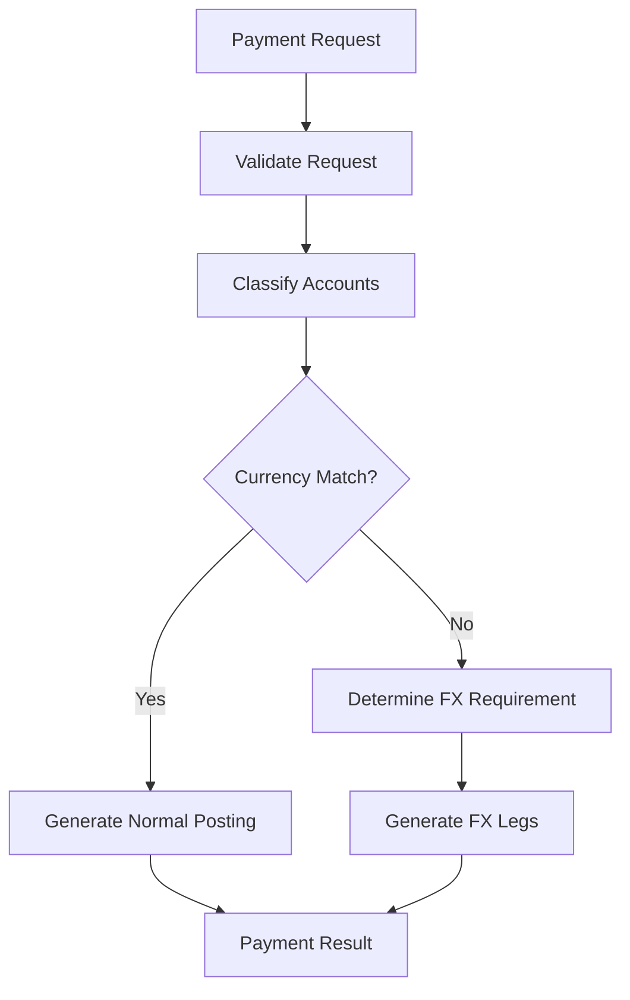

# Payment Component → Obsidian Knowledge Base Extraction

## Role

You are acting as a combination of:

1. **Senior Trade Finance Payment Domain Expert**
2. **Senior Payment / Accounting Business Analyst**
3. **Senior Software Architect**
4. **Senior Code Analyst**
5. **Enterprise Knowledge Engineer**
6. **Obsidian Knowledge Base Architect**

Your task is to analyze the entire **Payment Component Git repository** and transform the knowledge embedded in the source code, APIs, configuration, tests, documentation, and data models into a structured, traceable, AI-friendly **Obsidian Payment Knowledge Base**.

---

# 1. Primary Objective

Do NOT simply document source files, classes, or methods.

The primary objective is to extract:

> **Business Knowledge hidden inside the implementation**

Convert:

```text
Source Code
+ APIs
+ Data Models
+ Configuration
+ Tests
+ Existing Documentation
        ↓
Business Concepts
Business Rules
Payment Flows
Accounting Rules
FX Rules
Validation Rules
Integration Rules
Technical Architecture
Test Scenarios
        ↓
Obsidian Payment Knowledge Base
```

The resulting knowledge base must be understandable by:

* Trade Finance Business Analysts
* Payment SMEs
* Product Managers
* Developers
* Solution Architects
* QA/Test Engineers
* AI Coding Agents

without requiring them to read the entire source code.

---

# 2. Source of Truth

The **Git repository is the Source of Truth**.

Analyze all relevant sources, including:

* Source code
* API definitions / OpenAPI / Swagger
* Request / Response models
* DTOs
* Enums
* Validation logic
* Configuration
* Accounting/Postings logic
* FX processing
* Charge integration
* Suspense processing
* Database models
* Test cases
* Test data
* README
* CLAUDE.md
* Existing design documents
* Comments where they explain current behavior

Do not treat comments as authoritative when they conflict with executable code or tests.

Use the following evidence priority when conflicts exist:

```text
1. Executable business logic
2. Automated tests
3. API/Data Model definitions
4. Configuration
5. Existing design documentation
6. Source-code comments
```

Record significant conflicts instead of silently choosing one interpretation.

---

# 3. Critical Rule — Never Hallucinate Business Knowledge

Never invent business rules.

Every important statement must be classified as one of:

* **CONFIRMED** — directly supported by code/tests
* **INFERRED** — strongly implied by multiple implementation points
* **UNCLEAR** — insufficient evidence
* **CONFLICT** — sources disagree

For INFERRED, UNCLEAR, or CONFLICT knowledge, explicitly state the evidence and uncertainty.

Do not convert assumptions into facts.

---

# 4. Extract Three Levels of Knowledge

## Level 1 — Implementation Facts

Extract:

* Components
* Services
* Classes
* Interfaces
* APIs
* Methods
* Data structures
* Fields
* Enums
* Validation
* Configuration
* DB mappings
* External integrations

These explain:

> How is it implemented?

---

## Level 2 — Business Rules

Identify rules such as:

* Payment classification
* Debit/Credit determination
* Customer account handling
* Nostro/Vostro handling
* Suspense handling
* Charge handling
* FX triggering
* Currency matching
* Amount validation
* Posting generation
* Settlement processing
* Bridge logic
* Transaction eligibility

These explain:

> What business rules does the system enforce?

---

## Level 3 — Domain Knowledge

Reconstruct higher-level knowledge such as:

* What is a Payment?
* What is Settlement?
* Why is Suspense required?
* When is FX required?
* How are Customer / Nostro / Suspense accounts related?
* How does the Payment Component support Trade Finance?
* How do Import LC / Export LC / Loans / Charges interact with Payment?

These explain:

> Why does the Payment Component behave this way?

Clearly identify domain explanations that are interpretations rather than directly encoded rules.

---

# 5. Reconstruct Business Logic

Do not document individual methods in isolation.

Reconstruct end-to-end business logic.

For each major function identify:

```text
Trigger
↓
Input
↓
Validation
↓
Classification
↓
Business Decision
↓
Accounting Decision
↓
FX Decision
↓
Posting Generation
↓
Output
↓
Error / Exception
```

Where appropriate, represent the flow using Mermaid.

Example:



---

# 6. Accounting Knowledge

Accounting logic is a first-class knowledge domain.

Identify:

* Debit Account
* Credit Account
* Customer Account
* Nostro
* Vostro
* Suspense
* Loan Account
* Charge Account
* Commission Account
* Margin
* FX Debit Leg
* FX Credit Leg
* Clearing accounts

For each accounting rule document:

```text
Business Event
Debit
Credit
Currency
Amount
Condition
Source
Example
```

Do not infer accounting entries unless supported by implementation evidence.

---

# 7. FX Knowledge

Create dedicated knowledge for FX processing.

Identify:

* FX trigger conditions
* Currency comparison
* Debit-leg currency
* Credit-leg currency
* Exchange rate source
* FX conversion
* FX pair generation
* Suspense FX handling
* Customer FX handling
* Nostro FX handling
* Charge-related FX
* Multi-currency processing
* Rounding

Explain both:

```text
WHEN FX occurs
```

and

```text
WHY the implementation determines FX is required
```

where the reason can be established from the code.

---

# 8. Business Rule Identification

Assign stable IDs to important rules.

Example:

```text
PAYMENT-RULE-001
PAYMENT-RULE-002
FX-RULE-001
SUSPENSE-RULE-001
CHARGE-RULE-001
POSTING-RULE-001
```

Each rule must contain:

```markdown
# FX-RULE-001 — FX Trigger

## Status
CONFIRMED

## Business Rule

...

## Conditions

...

## Result

...

## Example

...

## Source Evidence

- `src/.../FxService.ts`
- `src/.../PaymentService.java`
- `tests/.../fx.spec.ts`

## Related Knowledge

- [[FX Processing]]
- [[Suspense Account]]
- [[Posting Rules]]
```

---

# 9. Obsidian Vault Structure

Create the knowledge base under:

```text
/docs/obsidian-payment-kb/
```

Recommended structure:

```text
00-Home/
01-Domain-Concepts/
02-Business-Rules/
03-Payment-Flows/
04-Accounting/
05-FX/
06-Charges/
07-API/
08-Data-Model/
09-Architecture/
10-Test-Scenarios/
11-Decision-Tables/
12-Traceability/
90-Unclear-and-Conflicts/
99-Source-Map/
```

Do not create excessive tiny documents.

Prefer one meaningful business concept per note.

---

# 10. Obsidian Linking

Use Obsidian `[[Wiki Links]]` extensively.

Example:

```text
[[Payment]]
[[Settlement]]
[[Suspense Account]]
[[FX Processing]]
[[Customer Account]]
[[Nostro]]
[[Charge Component]]
[[Posting Rules]]
```

The objective is to create a **Payment Knowledge Graph**, not a collection of unrelated Markdown files.

Avoid orphan notes.

---

# 11. Metadata

Every important knowledge document should contain YAML metadata.

Example:

```yaml
---
knowledge_id: FX-RULE-001
title: FX Trigger Rule
domain: Payment
category: Business Rule
status: CONFIRMED
source_repository: Payment Component
last_verified_commit: <git-commit>
tags:
  - payment
  - fx
  - accounting
---
```

---

# 12. Git Traceability

Every business rule must be traceable back to implementation.

Record:

* Source file
* Class / function where applicable
* Relevant test
* Git commit

Example:

```markdown
## Source Evidence

Implementation:
- `src/payment/FxEngine.ts`
  - `determineFxRequirement()`

Tests:
- `tests/payment/FxEngine.spec.ts`

Verified against:

`Git Commit: 84ac219`
```

Never copy large source-code blocks into Obsidian.

Reference the source instead.

---

# 13. Requirement → Code → Test Traceability

Where evidence permits, build:

```text
Business Concept
      ↓
Business Rule
      ↓
API / Data Model
      ↓
Implementation
      ↓
Test Case
```

Create:

```text
12-Traceability/Payment-Traceability-Matrix.md
```

Example:

| Rule              | API            | Implementation | Test        | Status    |
| ----------------- | -------------- | -------------- | ----------- | --------- |
| FX-RULE-001       | PaymentRequest | FxEngine       | FX-TC-001   | Confirmed |
| SUSPENSE-RULE-001 | PostingRequest | PostingService | POST-TC-003 | Confirmed |

---

# 14. Decision Tables

Whenever multiple conditions control behavior, prefer a Decision Table.

Example:

| Customer | Nostro | Same Currency | FX Required  |
| -------- | ------ | ------------- | ------------ |
| Yes      | Yes    | Yes           | No           |
| Yes      | Yes    | No            | Yes          |
| Yes      | No     | No            | Analyze Rule |
| No       | Yes    | No            | Analyze Rule |

Populate the actual result only from repository evidence.

Decision tables are particularly important for:

* FX
* Account classification
* Posting
* Suspense
* Charges
* Debit/Credit
* Payment/Settlement routing

---

# 15. Test Cases as Business Knowledge

Do not treat tests merely as technical implementation.

Analyze test cases to identify:

* Business scenarios
* Boundary conditions
* Negative cases
* Expected accounting
* Expected FX behavior
* Validation rules

Convert significant scenarios into business-readable notes.

Example:

```text
Scenario
Given
When
Then
Accounting Impact
FX Impact
Source Test
```

---

# 16. Knowledge Gaps

Create:

```text
90-Unclear-and-Conflicts/Knowledge-Gaps.md
```

Record questions such as:

```text
GAP-001
Observed:
...

Source:
...

Problem:
Business intention cannot be determined.

Question:
Should XXX occur when YYY?
```

Never silently fill gaps with assumptions.

---

# 17. Source-to-Knowledge Map

Create:

```text
99-Source-Map/Source-to-Knowledge-Map.md
```

Example:

| Source            | Knowledge Generated                |
| ----------------- | ---------------------------------- |
| FxEngine.ts       | [[FX Processing]], [[FX-RULE-001]] |
| PostingService.ts | [[Posting Rules]]                  |
| ChargeBridge.ts   | [[Charge Integration]]             |
| payment.spec.ts   | [[Payment Test Scenarios]]         |

This allows developers to understand which knowledge may become stale when code changes.

---

# 18. Knowledge Freshness

Record the current Git commit:

```text
last_verified_commit
```

On subsequent executions:

1. Read the previous verified commit.
2. Execute Git diff.
3. Identify changed Payment Component files.
4. Determine which knowledge notes are affected.
5. Update only impacted knowledge where possible.
6. Update source references.
7. Mark potentially stale notes for review.
8. Update `last_verified_commit`.

Do not regenerate the entire Vault unnecessarily.

---

# 19. Required Home Page

Create:

```text
00-Home/Payment-Knowledge-Home.md
```

It should provide navigation to:

* [[Payment Component Overview]]
* [[Payment Architecture]]
* [[Payment]]
* [[Settlement]]
* [[Accounting Model]]
* [[FX Processing]]
* [[Suspense Account]]
* [[Charge Integration]]
* [[Business Rule Index]]
* [[Payment Flow Index]]
* [[API Index]]
* [[Test Scenario Index]]
* [[Payment Traceability Matrix]]
* [[Knowledge Gaps]]

A new developer or BA should be able to start from this page and understand the Payment Component progressively.

---

# 20. Quality Review

Before completion, perform a self-review.

Score the generated Knowledge Base from **0–10** for:

| Dimension                   | Target |
| --------------------------- | -----: |
| Business Knowledge Coverage |  ≥ 9.0 |
| Code Traceability           |  ≥ 9.5 |
| Accounting Coverage         |  ≥ 9.0 |
| FX Rule Coverage            |  ≥ 9.0 |
| API Coverage                |  ≥ 9.0 |
| Test Traceability           |  ≥ 9.0 |
| Obsidian Linking Quality    |  ≥ 9.0 |
| Hallucination Control       |  ≥ 9.5 |
| Maintainability             |  ≥ 9.0 |

If any dimension is below target:

1. Explain why.
2. Identify the missing knowledge.
3. Improve the Knowledge Base.
4. Re-score it.

---

# 21. Final Deliverables

The final deliverables must include:

```text
/docs/obsidian-payment-kb/
```

with at minimum:

1. Payment Knowledge Home
2. Payment Component Overview
3. Architecture
4. Domain Concepts
5. Business Rule Index
6. Payment Flows
7. Accounting Rules
8. FX Rules
9. Charge Integration
10. API Knowledge
11. Data Model Knowledge
12. Test Scenarios
13. Decision Tables
14. Traceability Matrix
15. Knowledge Gaps
16. Source-to-Knowledge Map
17. Knowledge Quality Report

---

# 22. Final Principle

The goal is NOT:

> "Generate documentation from source code."

The goal is:

> **"Reverse-engineer the Payment Component into a maintainable, traceable Payment Domain Knowledge Base."**

A good result should allow a new BA, developer, architect, tester, or AI Agent to understand:

**What the Payment Component does → Why it does it → What rules govern it → How accounting/FX works → Where each rule is implemented → How each rule is tested.**
